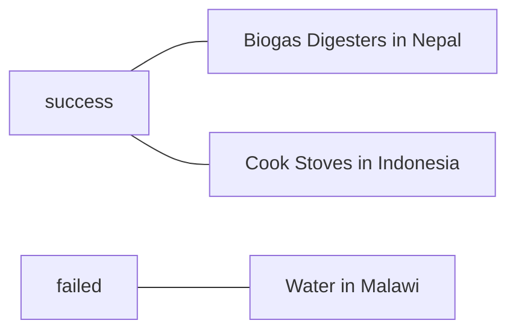

# C10

Bingcheng

516021910219

830 words

##CASE STUDY ONE—ENGINEERING AND PUBLIC KNOWLEDGE: THE “PREGNANCY” MODE ON QIHOO 360'S P1 WIRELESS ROUTER 

## The “fear marketing” of a wireless router 

1. A Chinese man was reported as having gone door to door, asking his neigh- bors to turn off their wireless routers: his wife was pregnant, and he feared the wireless signals would harm his unborn child 
2. Villagers from Dongguan, Guangdong province, China, staged protests forcing a mobile telecom company to shut down its base station: they also feared that mobile signals would adversely affect their health  

Chinese technology company Qihoo 360 released the P1 wireless router. Qihoo advertised the router as having a “pregnancy” mode, a setting that would ensure the health of expecting mothers and their unborn children. 

The decision to include a pregnancy mode was decided shortly thereafter, at the end of 2013. Although wireless and cellular devices emit radio-frequency electromagnetic fields, when designed and produced according to industry and legal guidelines, there is no evidence of health risks

## ENGINEERING AND SOCIETY: POSITIVE CONTRIBUTIONS

Engineers, it could be argued, have greater responsibilities than those of or- dinary citizens. This argument would be based on the expertise of engineers, again, where this expertise brings with it responsibilities.

### The Two Cultures View

one by scientists and engineers
one by humanists

### The Traditional Versus Superculture View

in the modern world, two cultures exist in tension, traditional culture and super- culture.

on the one hand, traditional culture is composed of folk technology, an emphasis on nations, the dominance of religious values, and loyalties to ethnic identities.

On the other hand, super- culture is composed of technological development, English as a common language, formal education, equality, and scientific ideals.

## THE RELATION OF ENGINEERS TO THE PUBLIC: PRINCIPLES OF INVOLVEMENT
1. Principle of Public Participation: Engineers Should Seriously Consider Participating in Public Policy Discussions Regarding Future Applications of Technology

2. Principle of Public Education: Engineers Should Seriously Consider Helping the Public to Understand the Applications of Technologies in Broader Social, Global Contexts
3. 3. Principle of Engineering Engagement: Engineers Should Seriously Consider Becoming Involved in Helping to Improve the Technological Futures of Those Less Fortunate Than Themselves, on a Voluntary Basis

## ETHICS AND THE LAW: THEIR SIMILARITIES AND DIFFERENCES

● Laws establish minimum standard for behaviors and are legally enforceable. By contrast, ethics establishes standards for good—rather than simply mini- mally acceptable—behaviors and might not be legally enforceable.
● Laws are instruments of compromise arrived at through legislative decision- making, while ethics aims at the good and is based on the use of reason.
● Laws can be immoral and amoral, since anything can be made legal or il-
legal in a given social context, while ethics are concerned with actions that have the potential to seriously affect the lives of others, thereby applying to a potentially more limited domain.
● Laws are slow to develop, covering new sets of circumstances, while indi- viduals can reflect on and reason about ethics at any time.
● Laws vary from society to society, while ethical principles should pro- vide relatively consistent results, or differences in their results should be principled.
● For each of the instances listed above, give examples of ways laws and eth- ics differ. Where necessary, be sure to clarify/explain your examples.

## ALIGNING INTERNATIONAL RESPONSIBILITY WITH LOCAL NEEDS: ENGINEERING AID WORK

### 1. Water in Malawi: From Failure to Long-Term Sustainability

Discovering many of the taps were not working, 81 of 113. Community members had attempted to patch pipes and fix broken taps, but due to a lack of available parts, they were unable to make the repairs.

EWBC did not plan for either the long-term maintenance or the funding of the system. 

The donors for aid projects do not necessarily have direct ties to the beneficiaries of these projects.

### 2. Biogas Digesters in Nepal: The Importance of Culture in User-Centered Design

After this new design was implemented, villagers reported a 36kg reduction in daily wood use per family (Lichtman, n.d.). The Technion team's “deep acquaintance with the community” in Namsaling undoubtedly contributed to the success of this project (EWB, n.d.).

Additionally, the economic benefits associated with digester fertilizer are particularly significant: the fertilizer is used in Namsaling to grow important cash crops such cardamom and ginger (Namsaling village, n.d.). 

### 3. Cook Stoves in Indonesia: The Importance of Culture in User-Centered Design 

Families generally use different stoves for different tasks, from cooking food to heating water. Some of these tasks are done inside, while others are done out- side. Some of the new stoves were not mobile enough to be used both inside and outside. Additionally, larger families generally cook larger meals to feed more people, and the new stoves simply did not have the capacity to do so. 

